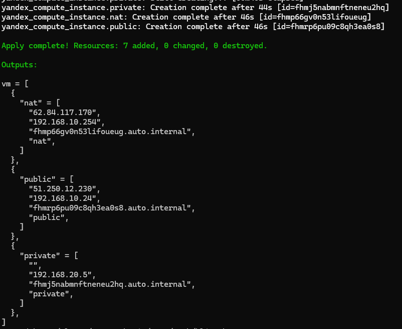
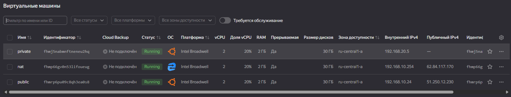
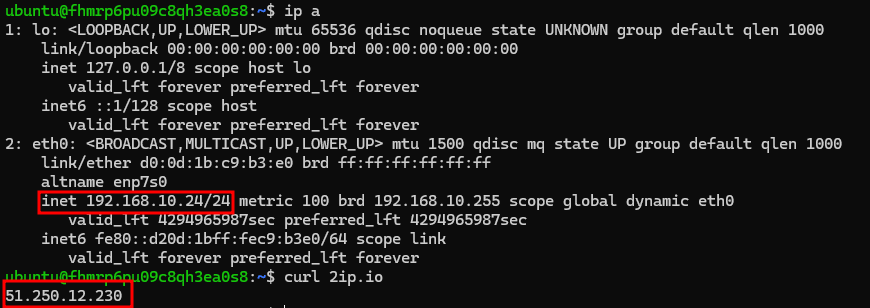
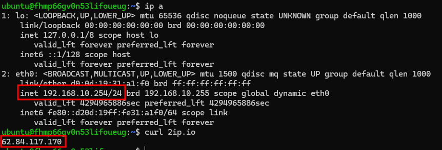
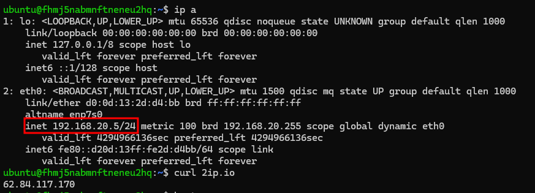

# Домашнее задание к занятию «Организация сети»

### Задание 1. Yandex Cloud 

**Что нужно сделать**

1. Создать пустую VPC. Выбрать зону.
2. Публичная подсеть.

 - Создать в VPC subnet с названием public, сетью 192.168.10.0/24.
 - Создать в этой подсети NAT-инстанс, присвоив ему адрес 192.168.10.254. В качестве image_id использовать fd80mrhj8fl2oe87o4e1.
 - Создать в этой публичной подсети виртуалку с публичным IP, подключиться к ней и убедиться, что есть доступ к интернету.
3. Приватная подсеть.
 - Создать в VPC subnet с названием private, сетью 192.168.20.0/24.
 - Создать route table. Добавить статический маршрут, направляющий весь исходящий трафик private сети в NAT-инстанс.
 - Создать в этой приватной подсети виртуалку с внутренним IP, подключиться к ней через виртуалку, созданную ранее, и убедиться, что есть доступ к интернету.

---

 ## Ответ

 Подготовил конфигурацию [terraform](./src/) согласно условиям задания:
 
 - Подсеть public и одной ВМ public и NAT-инстанс 
 - Подсеть private, таблицу маршрутизации route_nat и ВМ private

 Применяю конфигурацию terraform:

 ```bash
terraform init
terraform validate
terraform plan
terraform apply
```
Получаю output:



Скрин инфраструктуры в облаке:



Проверяю интернет на public:



И на nat:



Создаю файл /root/.ssh/config для удобства подключения к private машине через джамп-хост со следующим содержимым:

```bash
Host jump
  HostName 51.250.12.230
  User ubuntu
  IdentityFile /root/.ssh/id_rsa

Host internal
  HostName 192.168.20.5
  User ubuntu
  ProxyJump jump
```

И подключаюсь к private vm для проверки работы интета:

```bash
ssh -i /root/.ssh/id_rsa internal
```



Всё работает по условию задания.

Удаляю развернутую инфраструктуру:

```bash
terraform destroy
```