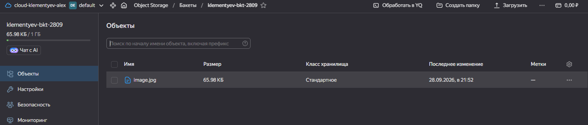
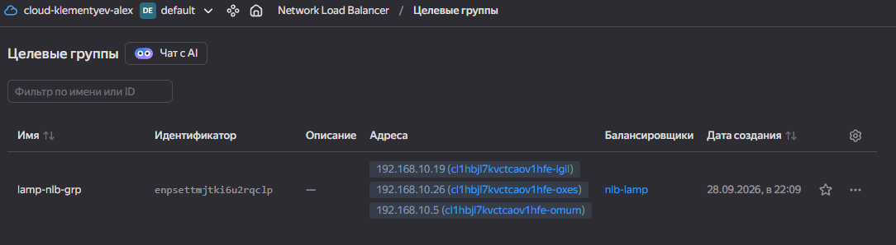
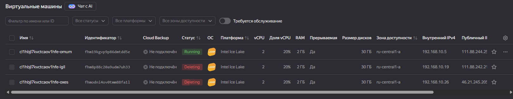
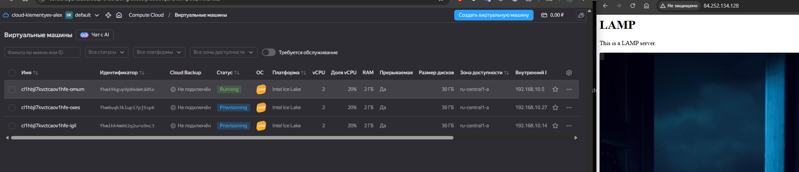

# Домашнее задание к занятию «Вычислительные мощности. Балансировщики нагрузки»

---
## Задание 1. Yandex Cloud 

**Что нужно сделать**

1. Создать бакет Object Storage и разместить в нём файл с картинкой:

 - Создать бакет в Object Storage с произвольным именем (например, _имя_студента_дата_).
 - Положить в бакет файл с картинкой.
 - Сделать файл доступным из интернета.
 
2. Создать группу ВМ в public подсети фиксированного размера с шаблоном LAMP и веб-страницей, содержащей ссылку на картинку из бакета:

 - Создать Instance Group с тремя ВМ и шаблоном LAMP. Для LAMP рекомендуется использовать `image_id = fd827b91d99psvq5fjit`.
 - Для создания стартовой веб-страницы рекомендуется использовать раздел `user_data` в [meta_data](https://cloud.yandex.ru/docs/compute/concepts/vm-metadata).
 - Разместить в стартовой веб-странице шаблонной ВМ ссылку на картинку из бакета.
 - Настроить проверку состояния ВМ.
 
3. Подключить группу к сетевому балансировщику:

 - Создать сетевой балансировщик.
 - Проверить работоспособность, удалив одну или несколько ВМ.
4. (дополнительно)* Создать Application Load Balancer с использованием Instance group и проверкой состояния.

---
## Ответ

Документация по S3
  - [Создание бакета](https://yandex.cloud/ru/docs/storage/operations/buckets/create)
  - [Загрузка объекта](https://yandex.cloud/ru/docs/storage/operations/objects/upload) через terraform.
  - Так же необходимо дать публичный доступ к объекту, по умолчанию доступ private [acl](https://github.com/yandex-cloud/docs/blob/master/en/_includes/storage/security/acl.md)

Создаю [код для terraform](./src/) для этого задания

Код создания бакета и объекта [s3.tf](./src/s3.tf) и его переменные [variables_s3.tf](./src/variables_s3.tf)

В результате создаётся бакет и в него загружается файл.

Создаю Network Load Balancer

Документация по созданию ВМ c LAMP стеком и NLB
  - [Установка LAMP](https://yandex.cloud/ru/docs/tutorials/web/lamp-lemp/terraform)
  - [Пользовательский init скрипт](https://yandex.cloud/ru/docs/compute/operations/vm-create/create-with-cloud-init-scripts)
  - [Создание NLB](https://yandex.cloud/ru/docs/tutorials/web/load-balancer-website)

Код создания
  - NLB [nlb.tf](./src/nlb.tf)
  - Группы размещения [vm_grp_lamp.tf](./src/vm_grp_lamp.tf)
  - Конфигурация ВМ [cloud-init.yml](./src/cloud-init.yml)

Применение этого кода создаёт три VM и NLB

Открываю браузер с ip NLB [http://84.252.134.128/](http://84.252.134.128/)

Удаляю две ВМ.

Страница по прежнему доступна и спустя некоторое время удаленные ВМ автоматически вновь создаются.

