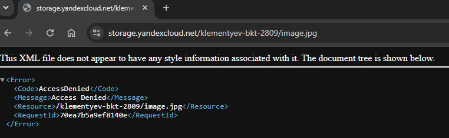
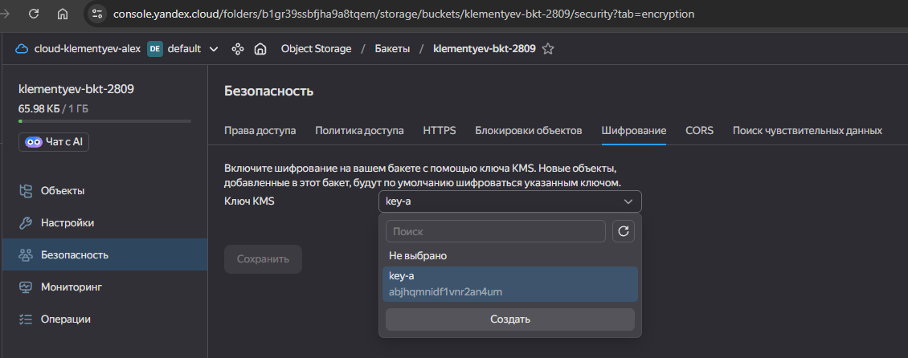

# Домашнее задание к занятию «Безопасность в облачных провайдерах»

Используя конфигурации, выполненные в рамках предыдущих домашних заданий, нужно добавить возможность шифрования бакета.

---
## Задание 1. Yandex Cloud   

1. С помощью ключа в KMS необходимо зашифровать содержимое бакета:

 - создать ключ в KMS;
 - с помощью ключа зашифровать содержимое бакета, созданного ранее.

 ---
## Ответ

Оставил только часть манифестов, относящихся к s3 от предыдущего задания. 

[Код для terraform](./src/) для этого задания

Отдельный манифест по созданию ключа kms [kms.tf](./src/kms.tf)

```bash
# ключ шифрования для бакета
resource "yandex_kms_symmetric_key" "key-a" {
  name              = "key-a"
  description       = "key for backet"
  default_algorithm = "AES_128"
  rotation_period   = "8760h" // 1 год
}
```

Добавляю в манифест [s3.tf](./src/s3.tf) шифрование бакета:

```bash
# включаю шифрование для бакета
  # https://yandex.cloud/ru/docs/storage/operations/buckets/encrypt
  server_side_encryption_configuration {
    rule {
      apply_server_side_encryption_by_default {
        kms_master_key_id = yandex_kms_symmetric_key.key-a.id
        sse_algorithm     = "aws:kms"
      }
    }
  }
```

Так же в манифесте s3.tf учел зависимости создания бакета от создания ключа шифрования:

```bash
depends_on = [yandex_kms_symmetric_key.key-a]
```

Так же пришлось сервисной учетной записи навесить необходимые права на добавление файлов в зашифрованный бакет. Без этих прав apply при добавлении файла завершался с ошибкой.

```bash
// Назначение роли сервисному аккаунту для работы с KMS-ключом
resource "yandex_kms_symmetric_key_iam_member" "sa-kms-encrypter" {
  symmetric_key_id = yandex_kms_symmetric_key.key-a.id
  role             = "kms.keys.encrypterDecrypter"
  member           = "serviceAccount:${yandex_iam_service_account.sa.id}"
}
```

Так же учел зависимость добавления файла в бакет от таски создания бакета и назначения роли сервисному аккаунту:

```bash
depends_on = [
    yandex_storage_bucket.backet,
    yandex_kms_symmetric_key_iam_member.sa-kms-encrypter
  ]
```

После применения манифеста получаю бакет с зашифрованным файлом:



