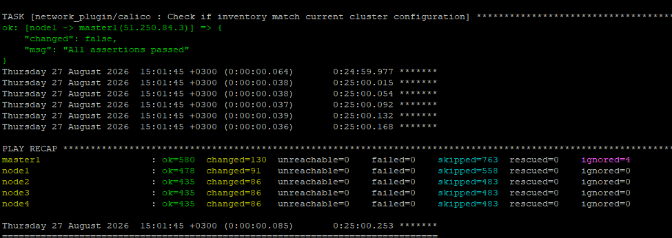
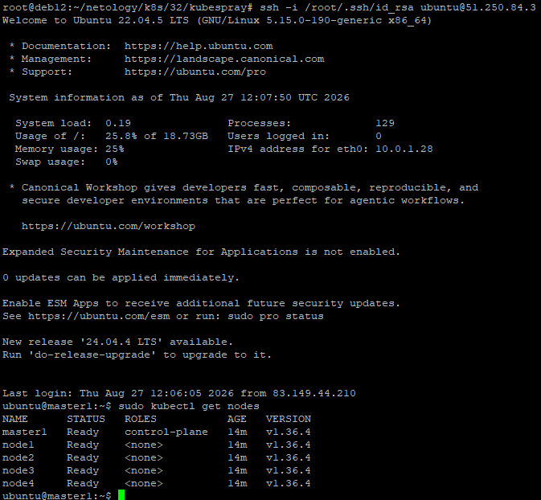

# Домашнее задание к занятию «Установка Kubernetes»

### Задание 1. Установить кластер k8s с 1 master node

1. Подготовка работы кластера из 5 нод: 1 мастер и 4 рабочие ноды.
2. В качестве CRI — containerd.
3. Запуск etcd производить на мастере.
4. Способ установки выбрать самостоятельно.

## Ответ

1. Подготовка работы кластера из 5 нод: 1 мастер и 4 рабочие ноды.

- Подготавливаю инфраструктуру через terraform.

   Инфраструктура описана в манифестах

   [main.tf](./src/main.tf)
[variables.tf](./src/variables.tf)
[outputs.tf](./src/outputs.tf)

Образ я взял отличный от заданного, т.к. в 20.04 нет нужных библиотек для развертывания k8s через Kubespray. Инфраструктуру развернул на ubuntu 22.04.

```bash
# Шпаргалка
# Выпуск нового токена для сервисной учетки
yc iam service-account list
yc iam create-token --impersonate-service-account-id 

# Развернуть описанную инфраструктуру
terraform init
terraform validate
terraform plan
terraform apply
```
2. Установка k8s через Kubespray
- правлю файл [inventory.ini](./src/inventory.ini) согласно поднятой инфраструктуре - 1 мастер 4 ноды.
- Запускаю плей:
     ```bash
     ansible-playbook -u ubuntu --private-key /root/.ssh/id_rsa -i inventory/mycluster/inventory.ini cluster.yml -b -v
     ```
- Получаю установленный кластер k8s:



- Проверяю установку на мастере:



