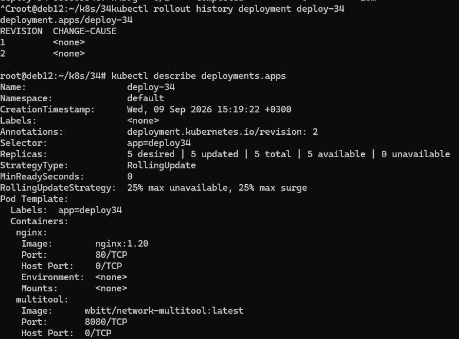
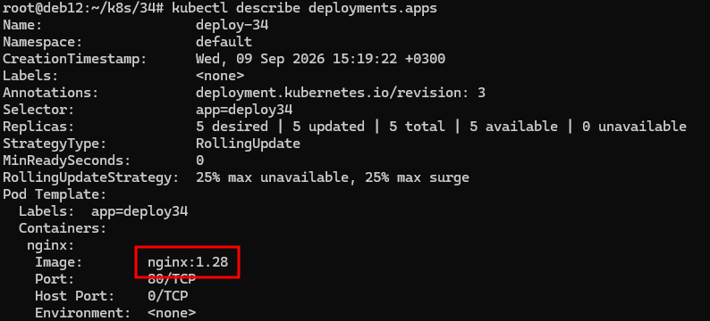
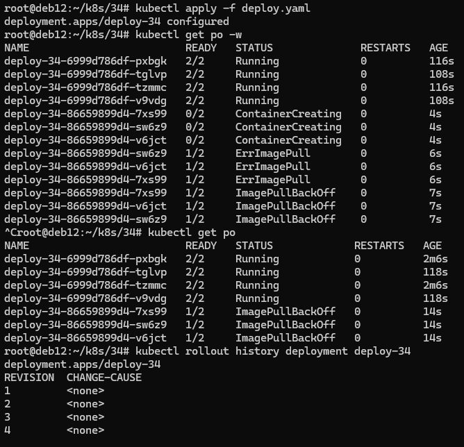
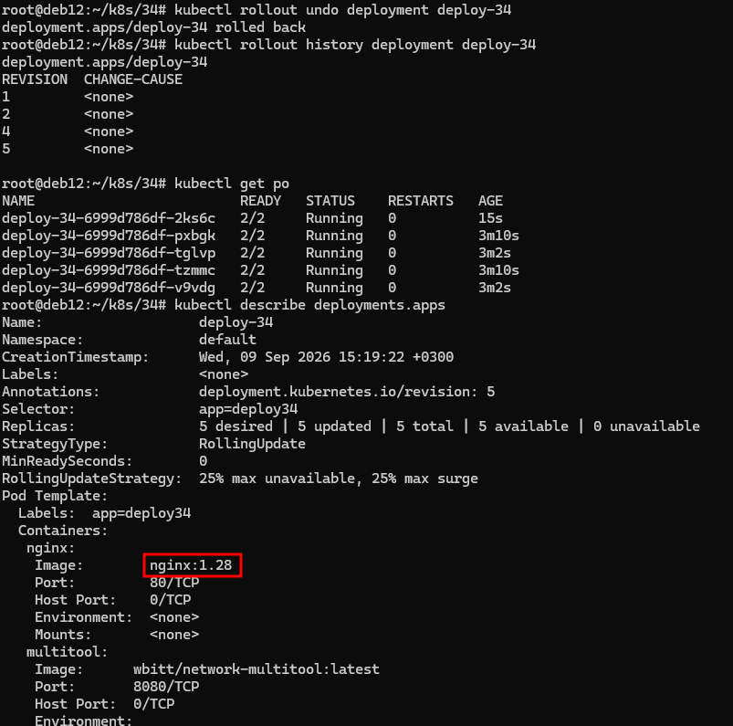

# Домашнее задание к занятию «Обновление приложений»

### Задание 1. Выбрать стратегию обновления приложения и описать ваш выбор

1. Имеется приложение, состоящее из нескольких реплик, которое требуется обновить.
2. Ресурсы, выделенные для приложения, ограничены, и нет возможности их увеличить.
3. Запас по ресурсам в менее загруженный момент времени составляет 20%.
4. Обновление мажорное, новые версии приложения не умеют работать со старыми.
5. Вам нужно объяснить свой выбор стратегии обновления приложения.

## Ответ

Учитывая мажорное обновление с разрывом совместимости и строгий лимит ресурсов (без возможности увеличить число подов), мы выбираем стратегию Recreate. Она позволяет остановить все старые поды и запустить новые за один шаг. Это единственный вариант, так как Rolling update не работает из-за несовместимости версий, а Blue‑green требует избыточного резервирования, которое мы не можем себе позволить (имеющийся 20‑процентный запас недостаточен для полноценного дублирования окружения). Отсутствие требования 100‑процентной доступности делает такой подход приемлемым.


### Задание 2. Обновить приложение

1. Создать deployment приложения с контейнерами nginx и multitool. Версию nginx взять 1.19. Количество реплик — 5.
2. Обновить версию nginx в приложении до версии 1.20, сократив время обновления до минимума. Приложение должно быть доступно.
3. Попытаться обновить nginx до версии 1.28, приложение должно оставаться доступным.
4. Откатиться после неудачного обновления.

## Ответ

Так как по условию приложение должно быть доуступным, была выбрана стратегия развёртывания Rolling update.

В манифесте опущен блок:
```
type: RollingUpdate
    rollingUpdate:
      maxSurge: 25%
      maxUnavailable: 25%
```
Так как по умолчанию куб использует именно эту стратегию.

Файл манифеста - [deploy.yaml](./app/deploy.yaml)


```bash
kubectl apply -f deploy.yaml
```

Заменяю в манифесте версию nginx на 1.20. Применяю. Проверяю версию приложения и версию nginx:



Заменяю вресию nginx в манифесте на 1.28 и так же применяю. Но этот образ существует и приложение обновилось:



Меняю версию nginx в манифесте на заведомо несуществующую. Тогда образ не пулится и контейнеры висят в ошибке:



Откатываю приложение на предыдущую работающую версию:

